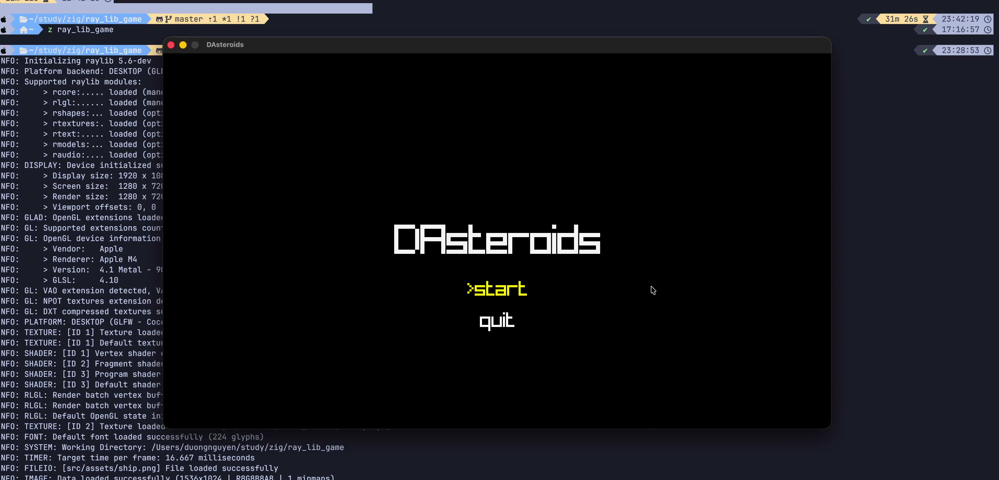

<h1>Asteroids game in Zig and Raylib</h1>

[](https://github.com/thompsonpayne/asteroids-raylib/releases/download/demo-video/game-demo.mp4)

## Prerequisites

- Zig 0.15.2 or newer
- C toolchain (clang/gcc) available on PATH
- Dependencies fetched with `zig build --fetch` (first-time setup or after clean)

## Build and run

```bash
# Build and run the game
zig build run

# Build only
zig build

# Install (default: zig-out/)
zig build install
```

## Tests and options

```bash
# Run all tests
zig build test

# Run module tests only
zig build test -- --mod

# Run executable tests only
zig build test -- --exe

# Release build and run
zig build run -Doptimize=ReleaseFast
```
